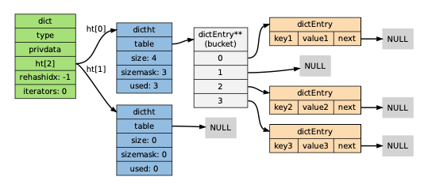

## Prologue

I will try to get acquainted with some of the latest technologies used in software engineering. So, out of no obvious reason, Redis will be my starting point I guess.

The good things about Redis could be found on [this Amazon page](https://aws.amazon.com/redis/). And I will rely on the book [*The Design and Implementation of Redis*](http://redisbook.com) (Chinese) and the source code ([v2.6](https://github.com/huangz1990/annotated_redis_source), [current](https://github.com/redis/redis)) to facilitate understanding. I choose the 1st version of the book that corresponds with Redis v2 as it is a shorter read, and the core of Redis remain the same.

Okay. Let's get started.

<br/>

# Internal Data Structures

## 1.1 Simple dynamic string (sds)

Redis is a Key-Value database. The Key is always a String while the Value can be a String, a Set, a List, etc.

Built with C, Redis replaced the by default ```char*``` type used to represent Strings with ```sds```.

### 1.1.1 Implementation

```c
typedef char *sds;

struct sdshdr {
	// buf space taken 
	int len;
	// buf space left 
	int free;
	// where sds is stored
	char buf[]; 
};
```
### 1.1.2 Summary

There are a few advantages ```sds``` could offer compared to ```char*```.

* efficient length calculation ```strlen```
* efficient string append ```append```
* Binary safe

```sds``` optimizes string append by allocating more memory in advance. This will lower the times that memory has to be reallocated. However, more memory space will be taken and the memory wouldn't be released automatically.

### 1.1.3 Examples
1. ```SET``` command
```bash
redis> SET msg "hello world"
OK
```
```SET``` command creates the following ```sds```
```c
struct sdshdr { 
	len = 11; 
	free = 0;
	buf = "hello world\0"; 
}
```
2. ```APPEND``` command
```bash
redis> APPEND msg " again!"
(integer) 18
```
By appending to ```msg```, we get
```c
struct sdshdr { 
	len = 18; 
	free = 18;
	buf = "hello world again!\0                  ";
}
```
The extra space we get after appending has to do with the memory allocation strategy that Redis offers.

<br/>

## 1.2 Doubly-linked lists
The implementation of doubly-linked lists in Redis is shown below.

```c
typedef struct listNode {
    struct listNode *prev;
    struct listNode *next;
    void *value;
} listNode;

typedef struct list {
    listNode *head;
    listNode *tail;
    void *(*dup)(void *ptr);
    void (*free)(void *ptr);
    int (*match)(void *ptr, void *key);
    unsigned long len; // # of nodes in the list
} list;
```

The ```value``` field of ```listNode``` has type ```void*```, which explicitly means it doesn't limit the type of value it stores.

And for different value types, sometimes different methods of ```dup()```, ```free()```, and ```match()``` are needed. Therefore we have a function pointer to handle that.

```c
typedef struct listIter {
    listNode *next;
    int direction;
} listIter;

/* Directions for iterators */
#define AL_START_HEAD 0
#define AL_START_TAIL 1
```
And we have an iterator for the list, also. It could iterate over the list from both directions.

### 1.2.1 Summary
Redis has a simple implementation of doubly-linked lists. It's being reused by many parts of the program.

* ```head``` and ```tail``` pointers makes popping and pushing *O*(1).
* ```prev``` and ```next``` pointers makes corresponding operations *O*(1).
* ```len``` makes taking length *O*(1).

### 1.2.2 Examples
```bash
redis> RPUSH brands Apple Microsoft Google
(integer) 3

redis> LPOP brands
"Apple"

redis> LLEN brands
(integer) 2

redis> LRANGE brands 0 -1
1) "Microsoft"
2) "Google"
```

<br/>

## 1.3 Dictionaries

Dicts, also known as Maps or Associative Arrays, is another data structure being used in Redis.

It's used for creating the key space for the database.

### 1.3.1 Implementation

```c
typedef struct dict {
    dictType *type;
    void *privdata;
    dictht ht[2];
    long rehashidx; /* rehashing not in progress if rehashidx == -1 */
    unsigned long iterators; /* number of iterators currently running */
} dict;
```

The ```dict``` type in Redis used hashtable implementation. The ```ht[2]``` are the pointers Redis uses to point to the hashtable of the dictionary. Except when rehashing, only ```ht[0]``` is in active use.

Then, the implementation of the hashtable:

```c
typedef struct dictht {
    dictEntry **table;
    unsigned long size;
    unsigned long sizemask;
    unsigned long used;
} dictht;

typedef struct dictEntry {
    void *key;
    union {
        void *val;
        uint64_t u64;
        int64_t s64;
        double d;
    } v;
    struct dictEntry *next;
} dictEntry;
```
```dictht``` has a ```**table``` field which serves as the bucket for the entries. Every element of ```**table``` is a pointer to a ```dictEntry```.

And, ```dictEntry``` holds a key-value pair. More to that, it has a pointer to anther ```dictEntry```, which implies that Redis uses seperate chaining to deal with collisions.

The structure of the ```dict``` type could be illustrated as below:


There are also very specific ways that Redis does rehashing, dict expansion, and dict shrink. As I feel that's not the core of the notes, I'll leave it to another time.

### 1.3.2 Hashing algorithm

There are two different hashing algorithms in use in Redis.
* MurmurHash2 32 bit, which has good speed and distribution.
* djb, which is case-insensitive.

### 1.3.3 Summary

* The database and hash keys are implemented with ```dict``` in Redis.
* ```dictht``` uses seperate chaining to resolve collision.

### 1.3.4 Examples

```bash
redis> SET number 10086
OK
redis> GET number
"10086"
redis> DBSIZE
(integer) 1
```
Of course, the ```GET``` operation uses hashtable as its driver. And the ```DBSIZE``` operation returns the ```size``` field in ```dictht``` type.

<br/>

## 1.4 Skip lists

Skip lists are a kind of randomized data structure that is good for searching. It could match the performance of balanced trees, *O*(*log* n), in finding, deletion, and addition operations.

For an introduction, visit [here (zh)](https://lotabout.me/2018/skip-list/) or [Wikipedia (en)](https://en.wikipedia.org/wiki/Skip_list).


Still, a glimpse of the implementation.
```c
// server.h, API in t_zset.c
typedef struct zskiplistNode {
    sds ele;
    double score;
    struct zskiplistNode *backward;
    struct zskiplistLevel {
        struct zskiplistNode *forward;
        unsigned long span;
    } level[];
} zskiplistNode;

typedef struct zskiplist {
    struct zskiplistNode *header, *tail;
    unsigned long length;
    int level;
} zskiplist;

typedef struct zset {
    dict *dict;
    zskiplist *zsl;
} zset;
```

And for each node, only when both ```ele``` and ```score``` matches the query, the node could be claimed to be found.