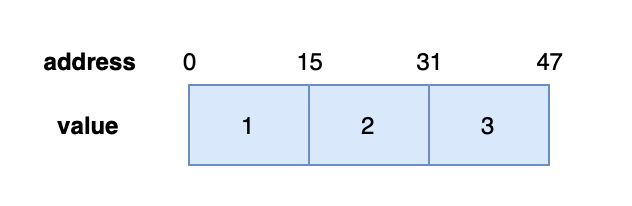
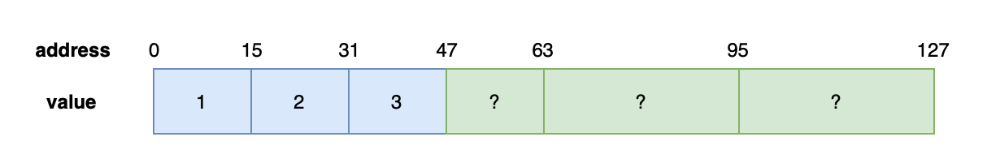
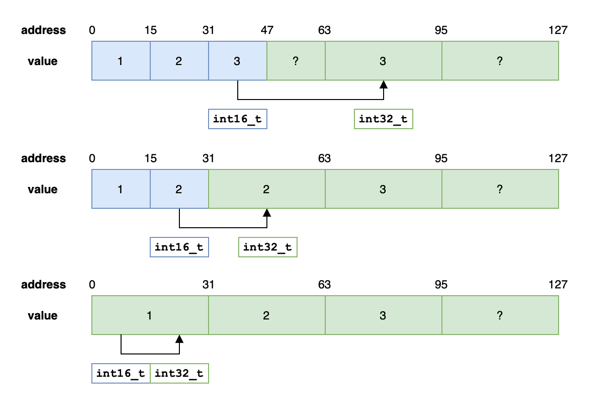
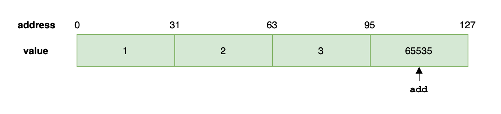
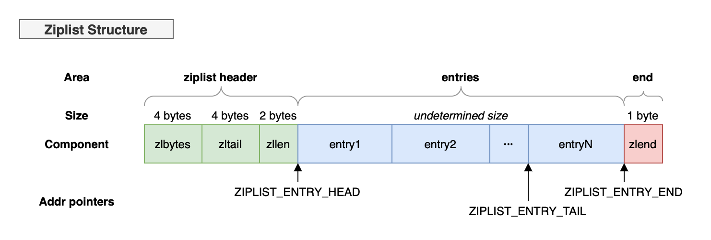

# Memory-mapping data structures

## 2.1 Integer sets (intset)

```intset``` is used to *orderedly and non-repeatingly* store multiple integer values. It will select the integer length of the set according to the input.

That is, if the largest integer is using ```int16_t```, then all of the integers in the set will be using ```int16_t```.

Therefore, one notable attribute of ```intset``` is its ability to **upgrade** to a new int type.

In Redis, if a set is integer only, and the size is not large, then Redis will use ```intset``` to store their value.

### 2.1.1 Implementation

```c
typedef struct intset {
    // The integer length of the set
    uint32_t encoding; 
    // The # of elements
    uint32_t length;
    // The storage
    int8_t contents[]; 
} intset;

#define INTSET_ENC_INT16 (sizeof(int16_t)) 
#define INTSET_ENC_INT32 (sizeof(int32_t)) 
#define INTSET_ENC_INT64 (sizeof(int64_t))
```

### 2.1.2 "Upgrading"

As mentioned above, ```intset``` performs upgrading when a new integer larger than the current length permits. Let's say there is an ```intset``` of the following configuration:

```c
intset->encoding = INTSET_ENC_INT16;
intset->length = 3;
intset->contents = [1, 2, 3];
```
Thus in memory, it is stored as



Now, we want to add an integer ```65535``` of length ```int32_t``` into the ```intset```. The ```inset``` will have to set its encoding to ```INTSET_ENC_INT32```, and reallocate the ```contents``` array.

* First, it will allocate memory enough for 4 ```int32_t``` integers.



* Then, it will transfer the ```int16_t``` integers to ```int32_t``` length in the order from the last to the first.



* Last, it will add the new integer ```65535``` into place and set the ```length``` field to 4.



Now we are done, the ```intset``` now looks like:

```c
intset->encoding = INTSET_ENC_INT32;
intset->length = 4;
intset->contents = [1, 2, 3, 65536];
```

### 2.1.3 Summary
It all seemed pretty intuitive, as it should be. In conclusion, ```intset``` has the following properties:

* Ordered, non-repeating.
* It will automatically select the length of the integers stored.
* The upgrading operation takes *O*(*n*).
* It does not "downgrade".
* As it is ordered, Redis uses binary search to find an element with *O*(log *n*).

<br>

## 2.2 Ziplists

A ziplist could have multiple entries. And each entry could store a char array (```char*```) or an integer. Ziplists are memory efficient and are stored continuously in memory.

### 2.2.1 Implementation
As ziplists take continuous memory to store its entries, and the entries could be of different size. Therefore, in order to be able to traverse the list, some metadata about the list and each entry are stored.
```c
unsigned char *ziplistNew(void) {
    unsigned int bytes = ZIPLIST_HEADER_SIZE+1;
    unsigned char *zl = zmalloc(bytes);

    // ziplist length
    ZIPLIST_BYTES(zl) = intrev32ifbe(bytes);

    // ziplist offset
    ZIPLIST_TAIL_OFFSET(zl) = intrev32ifbe(ZIPLIST_HEADER_SIZE);

    // ziplist # of entries
    ZIPLIST_LENGTH(zl) = 0;

    // ziplist tail
    zl[bytes-1] = ZIP_END;

    return zl;
}

typedef struct zlentry {
    // Size of the length of the previous entry
    unsigned int prevrawlensize, 
    // Length of the previous entry   
                 prevrawlen;    
    // Size of the length of this entry    
    unsigned int lensize,    
    // Length of this entry       
                 len;               
    unsigned int headersize;
    unsigned char encoding;
    // content of the entry
    unsigned char *p;
} zlentry;
```

Therefore, the in-memory storage of ziplists could be illustrated as:


### 2.2.2 Summary
Ziplists are

* Continuously-allocated lists that stores ```char*``` or ```int```.
* The base-level implementation of hash-key and sets.