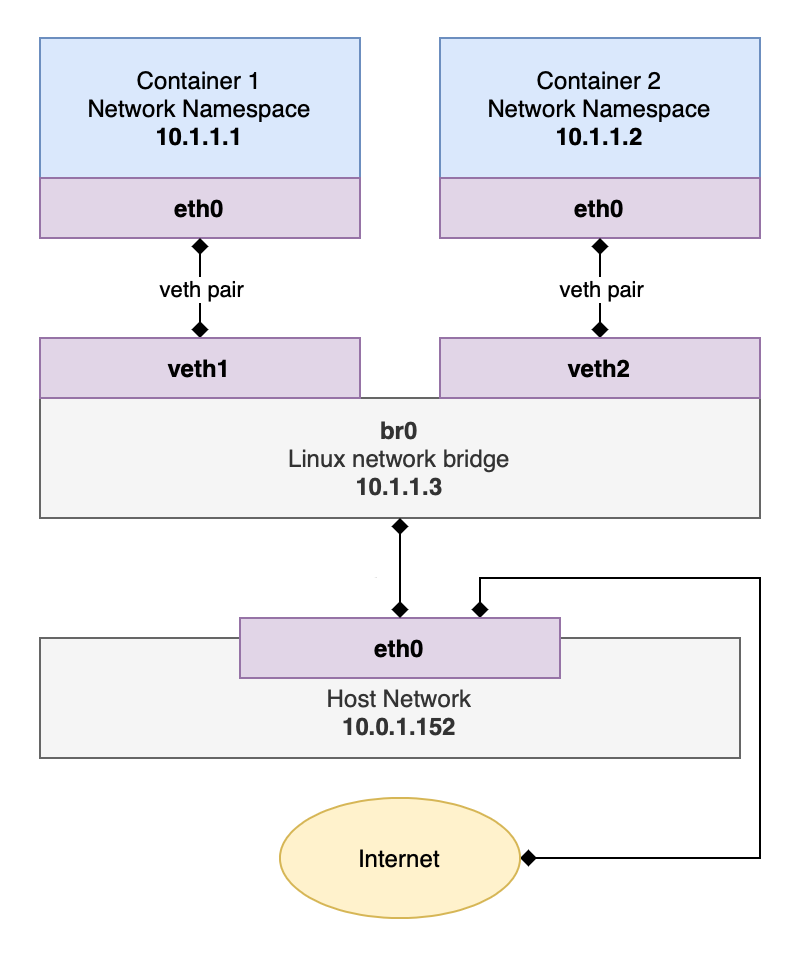

Last time, I looked into the Linux foundation of containers. But I left out one important part, networking.

Docker provided four options for networking when starting a container. We may select ```--net=none``` to not set up network support for our container.

And the goal would be to add network support to the netless container so that it may visit the internet or other containers.

First, let's take a look at the topology of a container network: 



The general idea is, each container runs in a network namespace. And those network namespaces are connected to the Linux bridge. The two-way arrows represent virtual ethernets.

With that in the mind, we are going to reconstruct the network step by step.

<br />

## Create network namespace

We need to obtain the PID of the container process to get it a network namespace (netns).

```
# docker ps
CONTAINER ID        IMAGE            COMMAND     ...        
6310cddb3d73        ubuntu           "/bin/bash" ...
# docker top 6
UID                 PID                 PPID ...
root                40995               40967 ...
```
Therefore, we could add a new netns by running
```
# ln -sf /proc/40995/ns/net /var/run/netns/con1
```
*Only by creating a symbolic link could we make the new netns work (by assuring that the container is of the created namespace). It's tested that solely by running the* ```ip netns add``` *command does not work.*

Examine by the following command, we could see that the netns has been successfully created.
```
# ip netns show
con1
```

<br />

## Create virtual ethernet pair
In a rough analogy, a virtual ethernet (veth) pair is like a network cable. We should create a veth pair and hook one in the pair to the container netns.

### Setup veth pair

```
# ip link add name veth1 type veth peer name veth2
# ip a
/* ... irrelevant info ... */
6: veth2@veth1: <BROADCAST,MULTICAST,M-DOWN> mtu 1500 qdisc noop state DOWN group default qlen 1000
    link/ether c2:15:f3:d5:21:a6 brd ff:ff:ff:ff:ff:ff
7: veth1@veth2: <BROADCAST,MULTICAST,M-DOWN> mtu 1500 qdisc noop state DOWN group default qlen 1000
    link/ether 7a:51:6e:b8:77:ac brd ff:ff:ff:ff:ff:ff
```

### Set ```veth1``` to ```con1``` namepace
```
# ip link set veth1 netns con1
# ip a
/* ... irrelevant info ... */
6: veth2@if7: <BROADCAST,MULTICAST> mtu 1500 qdisc noop state DOWN group default qlen 1000
    link/ether c2:15:f3:d5:21:a6 brd ff:ff:ff:ff:ff:ff link-netns 40995
```

From the ```ip a``` command, we could see that ```veth1``` is no longer showing as it is now being assigned into the ```con1``` namespace. Nonetheless, we could find ```veth1``` through running ```ip a``` in the ```con1``` netns.
```
# ip netns exec con1 ip a
7: veth1@if6: <BROADCAST,MULTICAST> mtu 1500 qdisc noop state DOWN mode DEFAULT group default qlen 1000
    link/ether 7a:51:6e:b8:77:ac brd ff:ff:ff:ff:ff:ff link-netnsid 0
```


### Create a Linux bridge

Now, in the pipeline is to connect ```veth2``` to a bridge to be created.

```
# ip link add name br0 type bridge
# ip link set veth2 master br0
# ip addr add 10.1.1.1/24 brd + dev br0
# ip netns exec con1 ip addr add 10.1.1.2/24 dev veth1
# ip netns exec con1 ip link set veth1 up
# ip netns exec con1 ip link set lo up
# ip link set veth2 up
# ip link set br0 up
# ip netns exec con1 ip route add default via 10.1.1.1
```
And now, test it again by running ```ping 10.1.1.2``` from outside the netns, we now could do it successfully. And we could also ```ping 10.1.1.1``` from inside the container.

<br />

## Link the bridge to the internet

Now, we could have the container reach any device in the local network. 

In this step, we'll connect to the internet. First, check 
```iptables -L```. If you see ```Chain FORWARD (policy DROP)``` somewhere in the result, execute these commands: ```# iptables -F FORWARD && iptables -P FORWARD ACCEPT```.

Then,


```
# sysctl -w net.ipv4.ip_forward=1
# iptables -t nat -A POSTROUTING -s 10.1.1.0/24 ! -o br0 -j MASQUERADE
# systemd-resolve --status
# mkdir -p /etc/netns/40995/
# echo "nameserver 100.100.5.6" > /etc/netns/40995/resolv.conf
```

Now, the container should be able to connect to the internet.


<br />

## References
[docker网络原理](https://github.com/int32bit/notes/blob/master/cloud/docker网络原理.md)\
[How Docker Container Networking Works - Mimic It Using Linux Network Namespaces](https://dev.to/polarbit/how-docker-container-networking-works-mimic-it-using-linux-network-namespaces-9mj)\
[Introduction to Container Networking](https://rancher.com/learning-paths/introduction-to-container-networking/)
