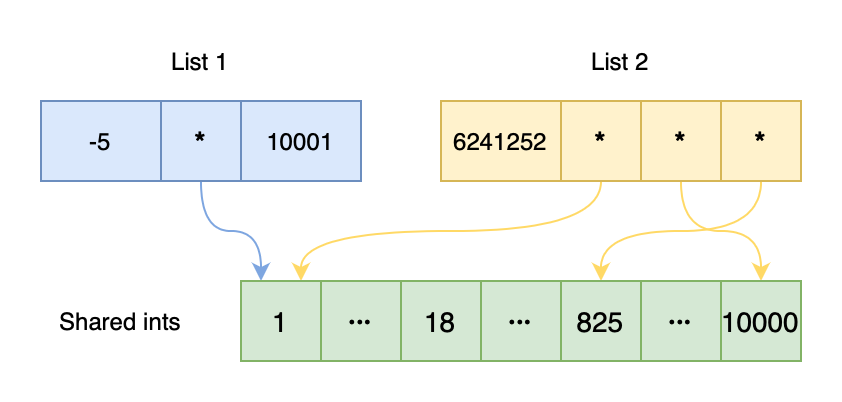
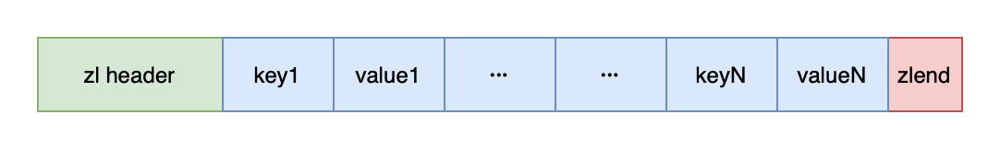
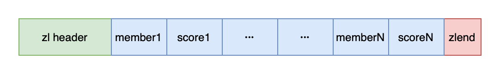

# Redis datatypes

After spending some seemingly bewildering time of introducing the basic data structures in Redis, we are getting into the Redis datatype system.

> "Wait, haven't we *already* been talking about datatypes?"

Well, yes and no.

In the previous chapters, we introduced ```sds```, skip lists, ziplists, ```intset```, etc. Those are the *implementations* of the datatypes that users interact with, such as strings, lists, and sets. We have ```sds``` and ```long``` for strings, skip lists, ziplists, and ```intset``` for list and sets, etc.

Therefore, there needs to be a way of keep tracking of the datatypes for each key, in spite of their implementation. And as a result, users should be able to call methods, for example ```ZADD```, on values regardless of the internal data structure, which could be dicts or ```intset```.

Yeah, that's called polymorphism. As C is not an OO language, Redis implemented its way of handling "objects", type-checks, explicit polymorphism, and object life-cycles.

## 3.1 Redis objects

### 3.1.1 Implementation
```c
// server.h
typedef struct redisObject {
    unsigned type:4;
    unsigned encoding:4;
    unsigned lru:LRU_BITS; /* LRU time (relative to global lru_clock) or
                            * LFU data (least significant 8 bits frequency
                            * and most significant 16 bits access time). */
    int refcount;
    void *ptr;
} robj;
```
As we could see, the struct ```redisObject``` documents the ```type```, ```encoding```, and ```ptr``` of the object. Where ```type``` is the types as users understands it, ```encoding``` is the actual implementation of the types, and ```ptr``` is a pointer to the data structure that keeps the value.

```c
// TYPE
#define OBJ_STRING 0    /* String object. */
#define OBJ_LIST 1      /* List object. */
#define OBJ_SET 2       /* Set object. */
#define OBJ_ZSET 3      /* Sorted set object. */
#define OBJ_HASH 4      /* Hash object. */

// ENCODING
#define OBJ_ENCODING_RAW 0     /* Raw representation */
#define OBJ_ENCODING_INT 1     /* Encoded as integer */
#define OBJ_ENCODING_HT 2      /* Encoded as hash table */
#define OBJ_ENCODING_ZIPMAP 3  /* Encoded as zipmap */
#define OBJ_ENCODING_LINKEDLIST 4 /* No longer used: old list encoding. */
// And more ...
```

### 3.1.2 Type-checks and polymorphism

Because of the ```redisObject``` struct, performing type-checks and polymorphism is much easier. When the user is performing an operation, Redis will:

1. Find the ```redisObject``` corresponds to the key in the database dictionary. If not found, return ```NULL```.
2. Check the ```type``` of the ```redisObject```. If the type does not permit the operation that the user intends to perform, return type error.
3. Calls the method that corresponds to the operation for the ```encoding```.
4. Returns the return value of the method called in 3.

### 3.1.3 Object sharing

There are objects that are commonplace in Redis, such as some return values like ```OK```, ```ERROR``` strings, some small integers, etc. Of course, the shared objects could only be used in data types that uses pointers.

```c
struct sharedObjectsStruct {
    /* ... OTHER SHARED OBJECTS ... */
    *integers[OBJ_SHARED_INTEGERS], // 10,000
    /* ... OTHER SHARED OBJECTS ... */
};
```



Content of list 1: ```[-5, 1, 10001]```

Content of list 2: ```[6241252, 1, 825, 10000]```

### 3.1.4 Reference counter and destruction

As C is not garbage-collected, Redis uses reference counters to keep track of its objects.

* When an object gets created, it has ```refcount = 1```. 

* When an object gets shared and thus referenced by another source, it gets ```refcount++```. And when the other source finished using the object, it gets ```refcount--```.

* When the ```refcount``` of an object reduces to 0, the ```redisObject``` and the data structure it references to get released.

### 3.1.5 Summary

* Each Redis datatype has multiple implementations.
* Redis uses ```redisObject``` to perform type-checks and polymorphism.
* Redis pre-allocates common small objects open for sharing to reduce memory usage.
* Redis uses reference counters to collect garbage.

<br>

## 3.2 Strings

String (```REDIS_STRING```) is the most common datatype in Redis. All the keys in Redis are stored as strings.

There are two encodings for strings.

```REDIS_ENCODING_INT``` is used for ```long``` ints solely. Well, it is ```long```, nothing special.

```REDIS_ENCODING_RAW``` uses ```sdshdr``` to store ```sds```, ```long long```, ```double```, and ```long double```. And it is ```sds```, nothing special, either.

<br>

## 3.3 Hash tables

Hash tables (```REDIS_HASH```) are implemented by ziplists (```REDIS_ENCODING_ZIPLIST```) and dicts (```REDIS_ENCODING_HT```).

For dicts, it's straightforward. Key as key and value as value.

Hash tables are stored in ziplists as key-value pairs gets squashed together. New pairs will be added to the end of the list.



### 3.3.1 Choice of encoding

When an empty hash table is created, Redis opts ziplists to store it, until:

* The length of any key or value exceeds ```server.hash_max_ziplist_value``` (64 by default). Or,
* The number of entries in the ziplist exceeds ```server.hash_max_ziplist_entries``` (512 by default).

<br>

## 3.4 Lists

Lists (```REDIS_LIST```) are implemented by ziplists 
(```REDIS_ENCODING_ZIPLIST```) and linked lists (and in newer versions, quicklists) (```REDIS_ENCODING_LINKEDLIST```).

### 3.4.1 Choice of encoding

When an empty list is created, Redis opts ziplists to store it, until:

* The length of any key or value exceeds ```server.list_max_ziplist_value``` (64 by default). Or,
* The number of entries in the ziplist exceeds ```server.list_max_ziplist_entries``` (512 by default).

<br>

## 3.5 Sets

Sets (```REDIS_SET```) are implemented by ```intset``` (```REDIS_ENCODING_INTSET```) and dicts (```REDIS_ENCODING_HT```).

If the first entry of the newly created set is an integer, it is being created as an ```intset```. Otherwise, it's being created as a dict.

If the number of entries in the ```intset``` exceeds ```server.set_max_intset_entries``` (512 by default) or a new element is not an integer, then the ```intset``` set will be converted to a dict set.

When storing sets as dicts, the key is stored in the key field of the dict entries. And the value field is simple kept as ```NULL```.

<br>

## 3.6 Ordered sets

Ordered sets (```REDIS_ZSET```) are implemented by ziplists 
(```REDIS_ENCODING_ZIPLIST```) and skip lists (```REDIS_ENCODING_SKIPLIST```).

Ordered sets are stored in ziplists, similar to hash tables, as member-score pairs gets squashed together. New pairs will be inserted according to the score.



When a new ordered set is created, Redis opts ziplists to store it, until:

* The length of any key or value exceeds ```server.zset_max_ziplist_value``` (64 by default). Or,
* The number of entries in the ziplist exceeds ```server.zset_max_ziplist_entries``` (128 by default).