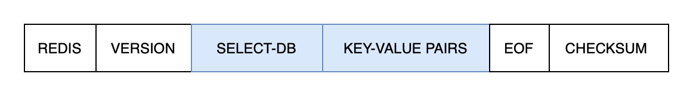
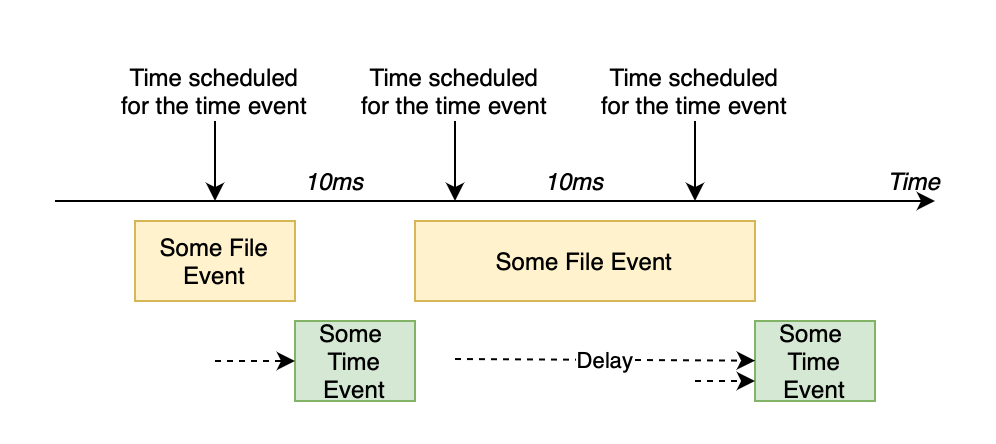

# Operating Mechanisms

## 6.1 The database

We are going to talk about in this last chapter the structure and implementation of the Redis database as a whole.

### 6.1.1 The database struct

```c
typedef struct redisDb {
    int id;
    dict *dict;
    dict *expires;
    dict *blocking_keys;
    dict *ready_keys;
    dict *watched_keys;
} redisDb;
```

The ```id``` field is the unique ID for the current database. 

The ```dict``` field is where all the key-value pairs are kept.

The ```expires``` field will be discussed in 6.1.3.

We talked about ```watched_keys``` in the last chapter.

### 6.1.2 The keyspace

The keyspace refers to the ```dict``` field in the redisDb struct. It allows operations such as ```SET```, ```DEL```, ```GET```, etc.

### 6.1.3 Expiration for keys

You could set the time of expiry for keys. When the time arrives, the key becomes no longer accessible. It behaves like:

```bash
redis> SETEX key 5 value
OK
redis> GET key
"value"
redis> GET key # after 5 secs
(nil)
```

The expiry of keys are stored in the ```expires``` dict of the database. There are 4 commands, namely ```EXPIRE```, ```PEXPIRE```, ```EXPIREAT```, and ```PEXPIREAT```, to set the expiry for a key. Their difference is on whether it's in seconds or milliseconds, counts from now or uses the UNIX timestamp.

However you set the expiry, Redis stores the expiry in ```expires``` as a UNIX timestamp in milliseconds.

### 6.1.4 When a key expires

With the ```expires``` dict, Redis finds whether a key is in the dict, and deletes it if the current UNIX time is larger than the UNIX timestamp the key has in ```expires```.

There are two possible mechanisms for deleting keys, one would be scheduled deletion, which deletes keys at a time interval. And lazy deletion, which does expiration checks only when a key is being used.

Scheduled deletions is good for memory used, while lazy deletion is good for CPU time.

Therefore, Redis uses a mix of the two mechanisms. It does scheduled deletion, but only allows for a set time to execute the deletion. And it also implements lazy deletion.

<br>

## 6.2 RDB

As Redis is an in-memory database at runtime, to ensure that the database is not lost when Redis restarts, Redis offers two options for persistence.

RDB takes a snapshot of the Redis database in memory and saves it to the hard drive.

There are two comands that do saves. ```SAVE``` and ```BGSAVE```. Both commands will invoke the ```rdbSave``` method, while ```SAVE``` does it in foreground and blocks the Redis process, ```BGSAVE``` will fork a child process and send a signal to the main process when saving is complete.

RDB will save to a RDB file which is structure as:



<br>

## 6.3 AOF

AOF is another persistence option offered by Redis. It documents all the commands that has been executed in Redis to preserve the state of Redis.

<br>

## 6.4 Events

Events are the core of Redis. There are two types of events in Redis:

* File events: multiplexes in multiple clients, accepts command requests from clients, and returns the response of execution.
* Time events: Does server cron jobs.

### 6.4.1 File events

**Read events** flag the sending states of a client command. We call a read event is ready when the client command is sent and received by server.

**Write events** flag the receiving states of a server response.

### 6.4.2 Time events

Time events records the actions that need to be run at specific time point. It uses an unsorted linked-list to store those time events.

Time events include:

* updating server stats, such as time, memory usage, etc;
* deleting expired keys;
* closing clients not in effect;
* performing AOF or RDB persistence;

etc.

In Redis, the default time interval for running a server cron is 10 ms.

### 6.4.3 Event execution and scheduling

In Redis, the strategy for scheduling events is:

1. An event will execute after the execution of another event. That is, there is no preemptive action in event execution.
2. File events are prioritized over time events.
3. The waiting time for file events is the shortest time among the time events.

Thus, if a file event is running when a time event is scheduled, the time event will be delayed.

And, if a file event takes more than the interval some time event is set to run, the time event would only run once at the end of the file event.

Therefore, events might run like below in actual.



<br>

## 6.5 Server and clients

The server will need to be initialized before it can accept commands.

The initialization has the following steps:

1. Initialize global status in ```redis.h/redisServer```;
2. Load config;
3. Create daemon process;
4. Initialize server functionality modules;
5. Load data from RDB or AOF;
6. Start event loops.

And the server will maintain a struct for each of its connected clients. The struct has all the status of the client.

The server accepts command from clients. And returns with response to the clients.