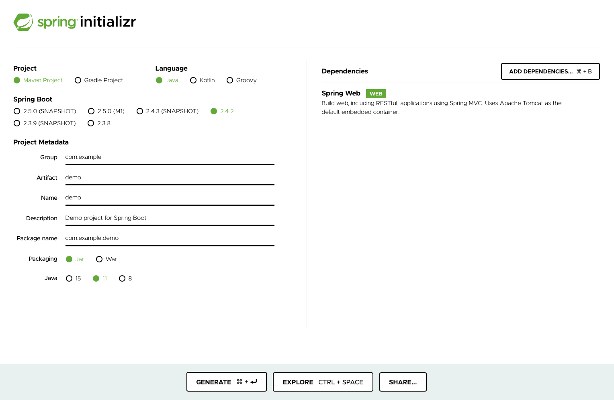
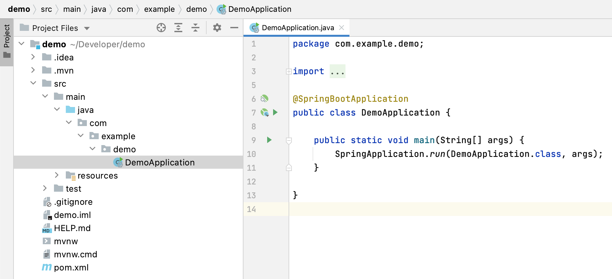
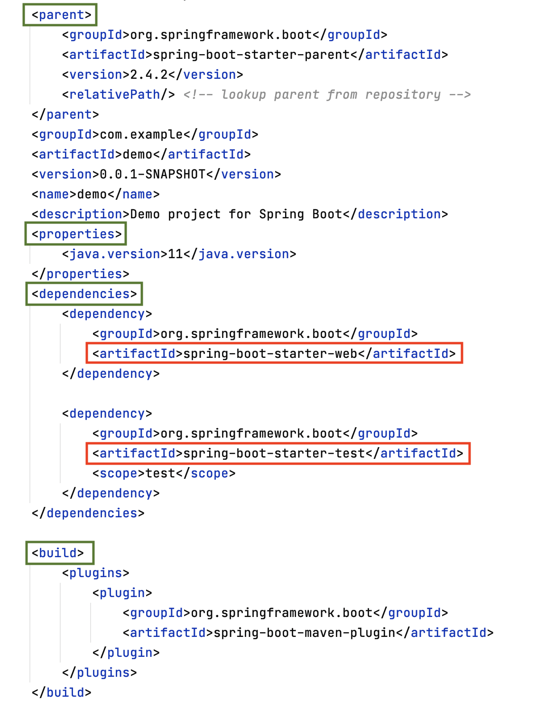

Upon finishing reading the [book]((http://redisbook.com)) on Redis, I decided to take on another popular technology in software engineering, the Spring framework.

This will be an overview on the application side based on the tutorial offered [here](http://www.ityouknow.com/springboot/2016/01/06/spring-boot-quick-start.html) and guides and documentation offered by spring.io.

Without further ado, let's get started.

<br>

# Setting off


To set up a vanilla Spring Boot web project, go to start.spring.io, and add Spring Web in the dependencies. If you have something look like below, you are good to go.



After downloading the demo, we can take a look at it.

There are three parts to a vanilla Spring Boot project as shown:

* `src/main/java`: the entry point of your program
* `src/main/resources`: some config files
* `src/test/java`: testing module



It is recommended to expand your project by dividing the code into packages `model`, `service`, and `controller`.

And in `pom.xml`, we may find the options we selected in the start.spring.io page.

<center>

</center>

Two dependency modules are by default selected. `spring-boot-starter`, and `spring-boot-starter-test`. As `spring-boot-starter-web` auto-refereces `spring-boot-starter`, we don't have to explicitly include it in `pom.xml`.

<br>

# Run it!

Then, let's set up a minimal web app that maps to the ``/hello`` dir of the website. It prints `Hello World!` by default. But when another name value is passed in through `?name=You`, it will display `Hello You!`.

```java
package com.example.demo;

import org.springframework.boot.SpringApplication;
import org.springframework.boot.autoconfigure.SpringBootApplication;
import org.springframework.web.bind.annotation.GetMapping;
import org.springframework.web.bind.annotation.RequestParam;
import org.springframework.web.bind.annotation.RestController;

@SpringBootApplication
@RestController
public class DemoApplication {

	public static void main(String[] args) {
		SpringApplication.run(DemoApplication.class, args);
	}

	@GetMapping("/hello")
	public String hello(@RequestParam(value = "name", defaultValue = "World") String name) {
		return String.format("Hello %s!", name);
	}
	
}

```

And run the server in the project dir:
```bash
./mvnw spring-boot:run
```

Now, we could access the web app at http://localhost:8080/hello.