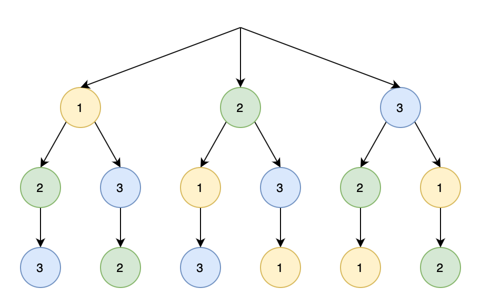
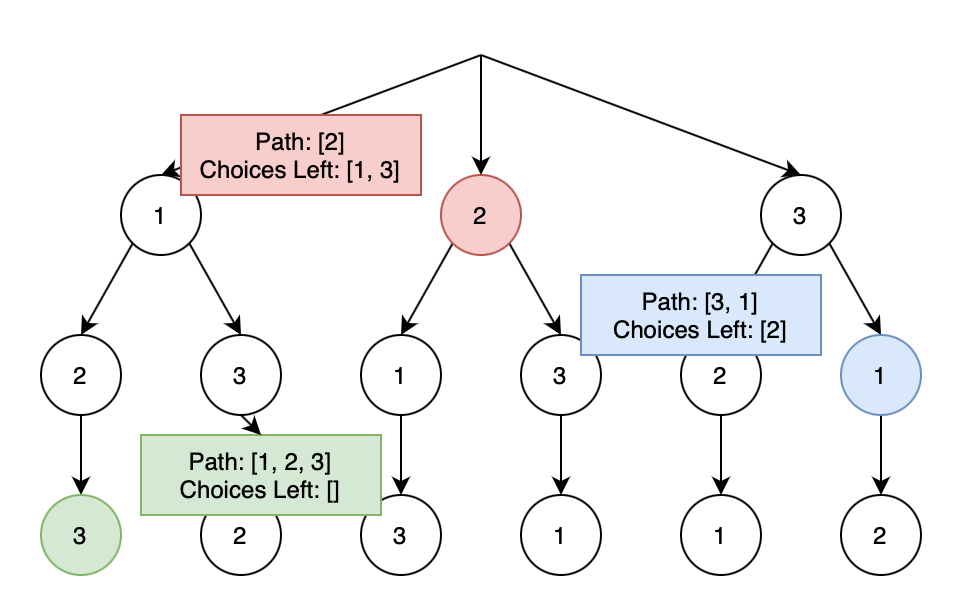

Well, the topic of this article is an algorithm, rather than a not-so-ideal behavior. This article will be a summary of the guide [here](https://mp.weixin.qq.com/s/nMUHqvwzG2LmWA9jMIHwQQ).

The core of solving a backtracking problem is traversing the decision tree related to the problem. There are three keys that would be helpful to bear in mind:

1. **Terminal condition**. When to stop.
2. **Path**. The choices made so far.
3. **Choices left**. Well, that's self-evident.

These 3 keys may seem puzzling at first. But we'll clarify by illustrating them with an example.

And, for any backtracking problem, the code goes like:
```py
result = []
def backtrack(path, choicesLeft):
    if terminal condition met:
        result.add(path)
        return

    for choice in choicesLeft:
        Make a choice
        backtrack(path, choicesLeft)
        Backtrack the choice
```

And the for loop is where we shall pay close attention to. We make a choice, then backtrack it.

Okay, it's possibly even more baffling now. So, let's get to the example.

<br>

# Permutations

---

**Leetcode 46: Permutaions**

Given an array nums of distinct integers, return all the possible permutations. You can return the answer in any order.

 

Example 1:
```
Input: nums = [1,2,3]
Output: [[1,2,3],[1,3,2],[2,1,3],[2,3,1],[3,1,2],[3,2,1]]
```

Example 2:
```
Input: nums = [0,1]
Output: [[0,1],[1,0]]
```

Example 3:
```
Input: nums = [1]
Output: [[1]]
```

---

Okay. If you recall middle school (or elementary), this is simple. For an array of `[1, 2, 3]`, you may come up with a tree like below, and you get the answer. And this tree, is the **decision tree** of this particular backtrack problem.



And, this is a decision tree, because before each node, you are deciding the number that you are choosing. Therefore, we may identify the **3 keys** that we mentioned above, and try to define the 3 keys for each of the node. The *path* and the *choices left* are shown in the diagram below, while the *terminal condition* is when there are no choices left.



Now we may find that, backtracking is merely a tree traversal problem. And we may recollect that to traverse a n-ary tree,

```python
def traverse(root):
    for child in children:
        # caveat 1
        traverse(child)
        # caveat 2
```

And, the backtracking algorithm simply adds two lines, making and backtracking a choice before and after traversing the child.

That is, in the parent node, when we are entering the child node, we take out the child node from the choices left; and, after we exited the child node, we restore the child node to the choices left.

```python
for child in children:
    # caveat 1
    path.append(choice)
    backtrack(path, choicesLeft)
    # caveat 2
    path.remove(choice)
```

And that's all for the core of backtracking problems.

```java
class Solution {
    private List<List<Integer>> ans;
    public List<List<Integer>> permute(int[] nums) {
        ans = new ArrayList<>();
        helper(nums, new LinkedList<Integer>());
        return ans;
    }
    
    private void helper(int[] nums, LinkedList<Integer> v) {
        if (v.size() == nums.length) {
            ans.add(new ArrayList<Integer>(v));
            return;
        }
        
        for (int n : nums) {
            if (v.contains(n)) continue;
            v.add(n);
            helper(nums, v);
            v.removeLast();
        }
    }
}
```