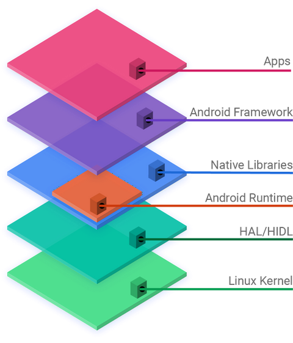
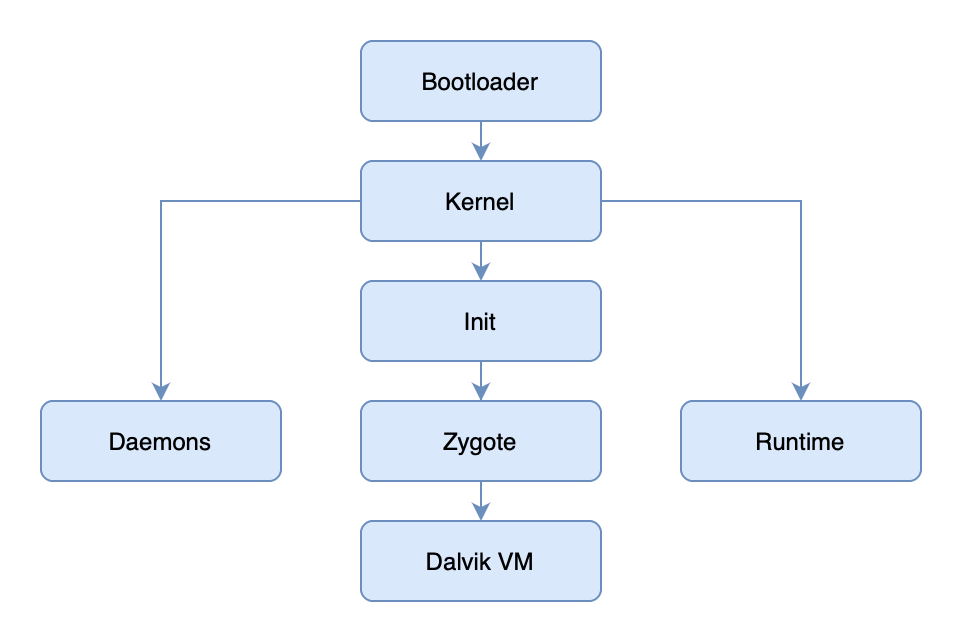

*For the GitHub repo of Dokrust, visit [**here**](https://github.com/lishpr/dokrust).*

This is the third week of Dokrust development. Well, it's a bit of a stretch to say it's a "development week", cause I'm not adding any new features to Dokrust. Instead, I'm investigating how to embed Android into Dokrust.

## Research

Android has this hierarchy as shown below. As it is built on Linux, in theory we could just run it in containers, sharing the Linux kernel with the host.

There are other projects such as [anbox](https://github.com/anbox/anbox), which enables us to run Android apps in Linux, [thyrlian/android-sdk](https://hub.docker.com/r/thyrlian/android-sdk), the Docker image of Android SDK, that have achieved similar goals of running Android in Linux or containerized environment. But, they are built on the Android SDK, in which the QEMU VM environment potentially would heavily impact app performance.

Therefore, the solution is to extract runtimes and libraries from an Android image and see whether they could be used directly in containers.

First, let's inspect the differences in the startup process in Android and general Linux.

After the kernel is loaded in Android, it would run `init`. `init` would trigger a daemon process which then brings up the `zygote` process. And the `zygote` process is the foundation of all other Android apps.

Okay, with this broad picture in mind, we should try to get `init` running, and start from there.

 

## Execution

We first start with building our own image from Android source code to reduce the chances of having weird problems in future.

Then, in the built images, we would merge the contents of `ramdisk.img` and `system.img` as the root file system for our container.

And run the container. It runs, which is not a surprise. We then should execute the `init` binary to see how it runs.

SELinux features should be turned on in the host system.

 

## Next up

Try to get `init` to work, as it runs into halt currently.