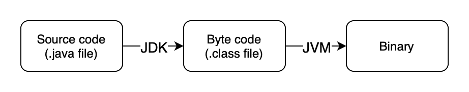

*Happy International Women's Day!*

This will be a series focuses on a pop-quiz style questions related to Java. I'm doing this mainly because of the interviews. Interviews for SDE positions in Chinese companies usually have this "pop quiz" section, where the interviewer asks you a bunch of questions that you would probably encounter once in a year and the interviewers wouldn't know them right off the bat without looking them up.

Nonetheless, life is life. So, let's dive into those frivolous in general yet occasionally interesting scattered pieces of the Java world.

Also, thanks to [Snailclimb](https://github.com/Snailclimb) for his articles.

<br>

## 1 What are JVM, JDK, and JRE?

**JVM** (Java Virtual Machine) is the VM that runs Java byte codes. JVM has different implementations on different platforms, in an effort to generate the same output on various platforms with the same byte code.


<center>

</center>

The use of JVM makes Java code more efficient when compared to pure interpretive languages, while also preserving portability which compiled languages lack.

**JRE** (Java Runtime Environment) is all it needs to run a Java program. It has a JVM, Java libraries, and other fundamental widgets. But you cannot create a Java program with JRE.

**JDK** (Java Development Kit) is an SDK. It includes a JRE, and the Java compiler (javac) and other tools. It could be used to create programs.

<br>

## 2 What are the differences between "`==`" and "`equals()`"?

**`==`** compares the value for primitive data types and the address for reference data types. That is, it has to be the exact same object for the `==` operator to have a true return value.

**`equals()`** is a method in the `Object` class. It by default invokes the `==` operator.

```java
public boolean equals(Object obj) {
     return (this == obj);
}
```
If a class overrode the equals class, for example, the `String` class, it would compare the value stored.

<br>

## 3 Is Java a "call by value" or a "call by reference" language?

The Java language is always call by value. That is, methods always get a *copy* of the passed in parameter. For example:

```java
public static void main(String[] args) {
    int num1 = 10;
    int num2 = 20;

    swap(num1, num2);

    System.out.println("num1 = " + num1);
    System.out.println("num2 = " + num2);
}

public static void swap(int a, int b) {
    int temp = a;
    a = b;
    b = temp;

    System.out.println("a = " + a);
    System.out.println("b = " + b);
}
```

Output:

```java
a = 20
b = 10
num1 = 10
num2 = 20
```

That is, swapping `a` and `b` does not affect `num1` and `num2`.

But this doesn't sound right? Then how do we actually do the swap?

As Java is always pass by value, thus for primitive types, the methods get copies of the passed in parameters. Then, for reference types, the methods get copied address of the variable.

For example:

```java
public static void main(String[] args) {
		int[] arr = { 1, 2, 3, 4, 5 };
		System.out.println(arr[0]);
		change(arr);
		System.out.println(arr[0]);
	}

	public static void change(int[] array) {
		array[0] = 0;
	}
```
Yields:
```java
1
0
```