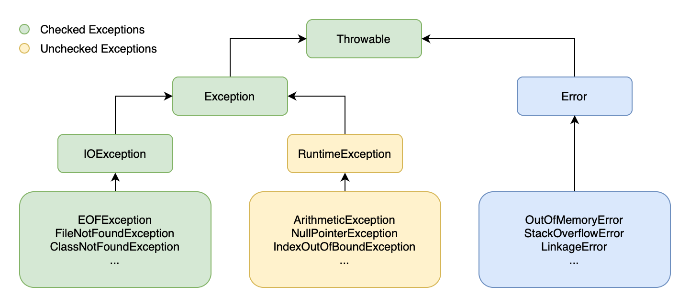
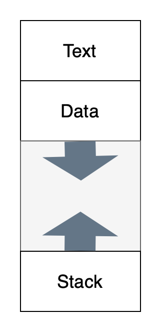

## 4 What is reflection in Java?

Java reflection is a mechanism which provides the information of all the properties and methods for any class and any object when in runtime. This particular kind of dynamic information retrieval and object call is reflection in Java.

In regular daily development, it's kind of rare to use reflection directly. But there are a lot of designs that utilizes reflection.

 

## 5 How to handle throwables?

Errors and exceptions are two types of Java throwables. Exceptions are the kind of throwables that Java programs could process. We could use `catch` to process them.

While errors are the throwables that programs could not process and thus cannot be caught. When errors happen, JVM will stop the thread.

If a checked exception is not caught, the code does not compile.

`try-catch-finally` is often used to handle exceptions.

 

## 6 The memory model of JVM

### 6.1 Process Memory Structure (PMS)

Let's take a look at the PMS. There are three parts in the PMS, Text, Data, and Stack.

* Text part has code, or program instructions.
* Data contains global variables and the Heap.
* Stack contains activation records.

While a thread is a single sequential path of execution. It is part of a process. The stack of a process is subdivided into thread stacks.

### 6.2 JVM

Each JVM is responsible for one Java program. Therefore, like I described in 6.1, there is a **heap**, all the objects that are `new`'ed will be allocated on the heap; and there is a **method area**, which stores all the statics and code.

More, for each thread, there is a **stack** that is private to the thread that stores all the activation records. A **native method stack** that runs C/C++ code. And, a **program counter register**.