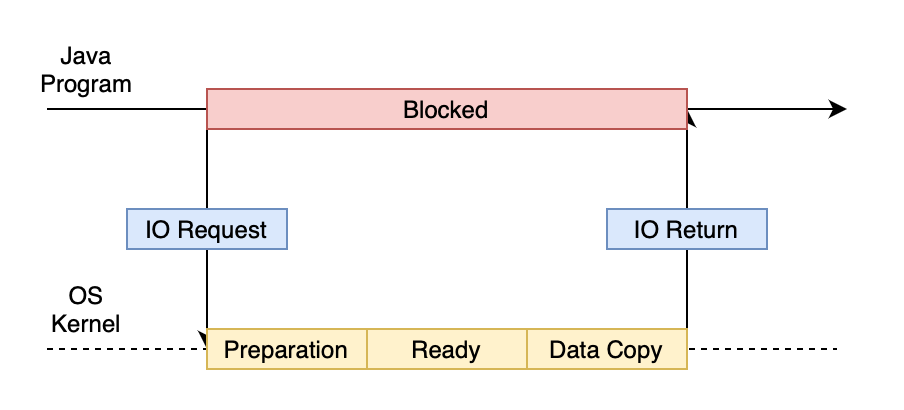
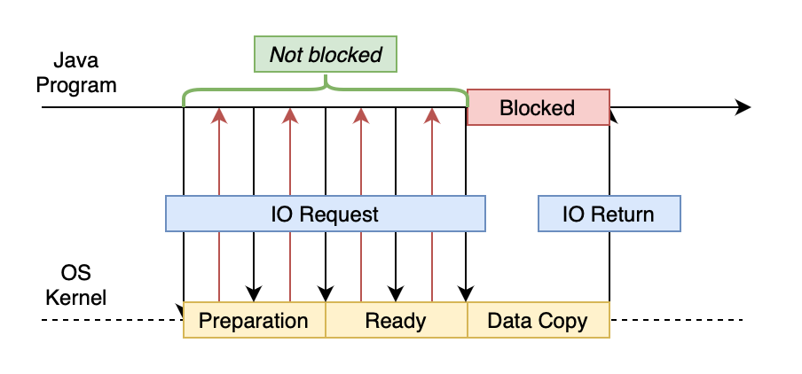
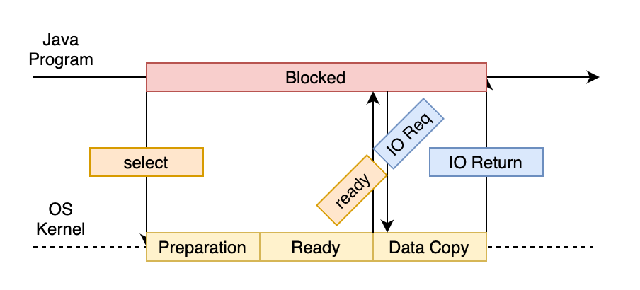
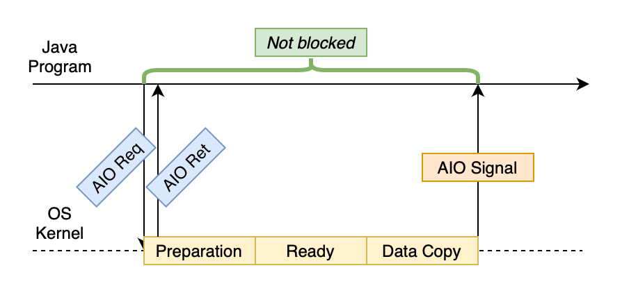

I/O stands for input/output. According to the Von Neumann architecture，there are five units in a computer system, namely the control unit, arithmetic unit, memory unit, *input and output* device. 

From the perspective of a program, I/O operations are handled in kernel space. For a Java program in user space, when an request to access a file, a piece of memory, or some network service is made, it is actually done by invoking a system call.

Therefore, our Java program has to somehow wait for system IO. Then, the operating system will
* Waiting for the data to be ready
* Copying the data from the kernel to the process

There are 5 prominant IO models in UNIX. They are

* Synchronous IO
* Blocking IO
* Non-blocking IO
* Multiplexing IO
* Signal-driven IO
* Asynchronous IO

As signal-driven IO is not common, we'll focus on the other four.

## BIO

**BIO** (Blocking I/O) is to block the running process until the program hears response from the kernel. It works in light loads, but this is very inefficient. 

 

## NIO

**NIO** (Non-blocking I/O) is introduced in Java 1.4 to solve the efficiency problem in BIO. But as it will constantly poll the kernel for whether the data is ready, it costs system resources to do so.

 

## IO Multiplexing

As NIO requires the program to poll the kernel, which takes up a lot of system resources, the idea of **IO Multiplexing** (aka event-driven IO) came about. In IO multiplexing, a kernel call, `select`, will monitor the IO sockets. When the data is ready in any of the sockets of the processes that had called `select`, `select` will return a signal to the process to perform the actual IO request.

An example is shown below. Intuitively, the process is blocked as in BIO, and even worse because in this case 2 system calls are invoked instead of 1. But IO multiplexing is more efficient when multiple processes is in play, thus the `select` method could monitor IO sockets simultaneously.

 

## AIO

**AIO** (Asynchronous IO) does not perform sequential execution. It instantly returns an AIO request, and starts preparing the data. Finally, it directly copies the data into the process, and send a signal to the process.

