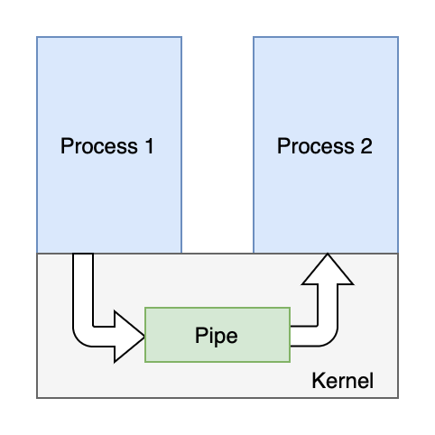

Each process gets its own share of memory address space. Therefore, the kernel provides a mechanism that allows data transfer from a process to another through the kernel. And this mechanism is called "inter-process communication" (IPC).

## Pipes / Named Pipes

Properties

* Pipes only accept one-directional data flow. When bi-directional messaging is needed, two pipes are needed.
* Could be used only within parent-children or sibling processes.
* Uses unique file system. The pipe, for the processes which utilize it, is just a file. But it does not belong to any other file systems, and exists only in memory.
* Data is always written to the end of the pipe buffer, and read from the beginning of the buffer.
* The data in the pipe is formatless. 

The advantages and disadvantages of pipes are quite the same as their properties.

Named pipe is then created to allow any process to communicate, not just the related processes. 

 

## Signals

* Signals are a kind of mechanism used for IPC in Linux. Signals could be sent to any process without knowing the status of the process beforehand.
* If a process is not running, the kernel will store the signal until the process responds.
* If a process is blocked, the transmission of the signal is delayed until the process is no longer blocked.

Signals are used by kernel to notify the process in user space of a system event. The signal could be from hardware, such as a `ctrl+c` interrupt from the user; or software, such as a `kill` command.

### The lifecycle of signals

1. A signal is generated, a target process is set. This instruction is sent to the kernel.
2. The OS decides whether to send the signal depending on the status of the process. If the process is blocked, the OS will store the signal until the process is no longer blocked, then the OS will send it unless the process has quit.
3. When the target process receives the signal, it will preserve its contexts, and do what the presets of the signal.

 

## Message queues

MQs are linked lists stored in kernel. Differ from pipes, MQ stores its information in kernel, rather than a file system. MQs had types, and do not asked to be read in FIFO order. It would be wipe out only when the kernel restarts.

 

## Shared memory

Shared memory allows multiple processes to read/write a same section of memory. It is the fastest IPC mechanism, designed upon the inefficiency of other methods.

The kernel allocates a section of shared memory for processes, and the processes would map their private addresses onto the shared memory. This methods is much quicker in that it does not copy any data.

However, as multiple processes have access to a same section of memory, we need other mechanisms such as semaphores to prevent race conditions.

 

## Semaphores

Semaphores are a very tricky concept. Good that I took CSE 120. A semaphore is basically a counter used for synchronization. But you can access only by two atomic actions, `wait` and `signal`. Most importantly, you cannot test the value of semaphores.

Semaphores could be used to synchronize multiple processes when they are accessing one same part of code. When a semaphore is greater then 0, the process could access the part; else, no.

 

## Sockets

Sockets are a way that allows communication between computers. It is the basic operation unit of network communication over TCP/IP.